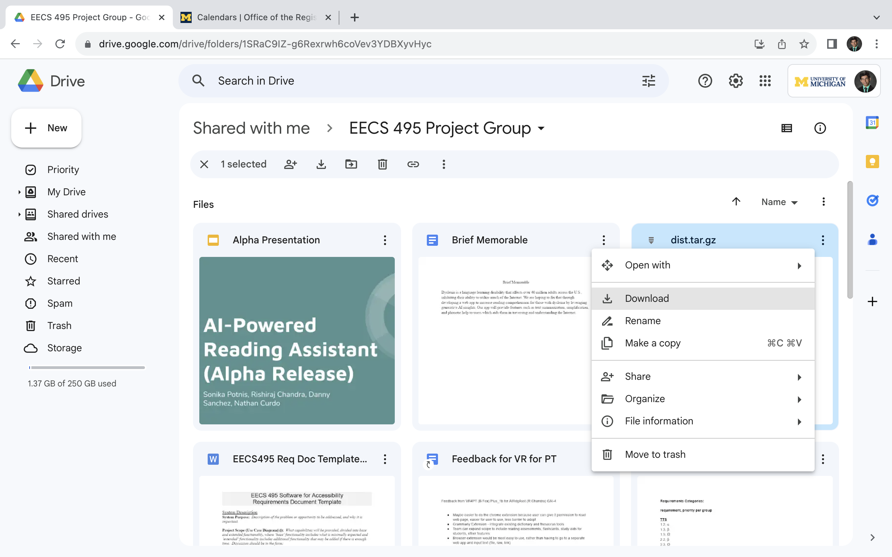
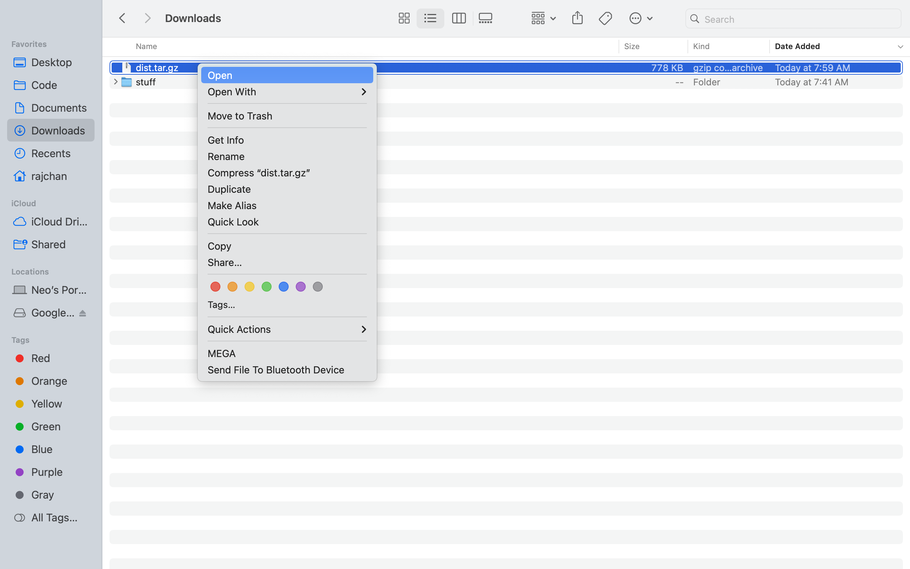
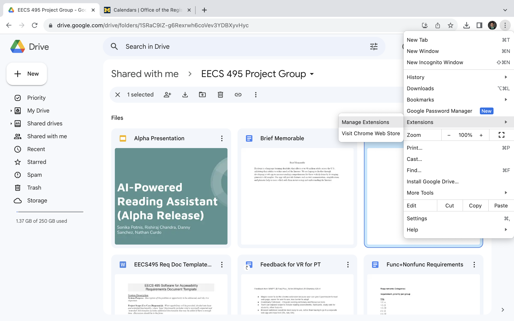
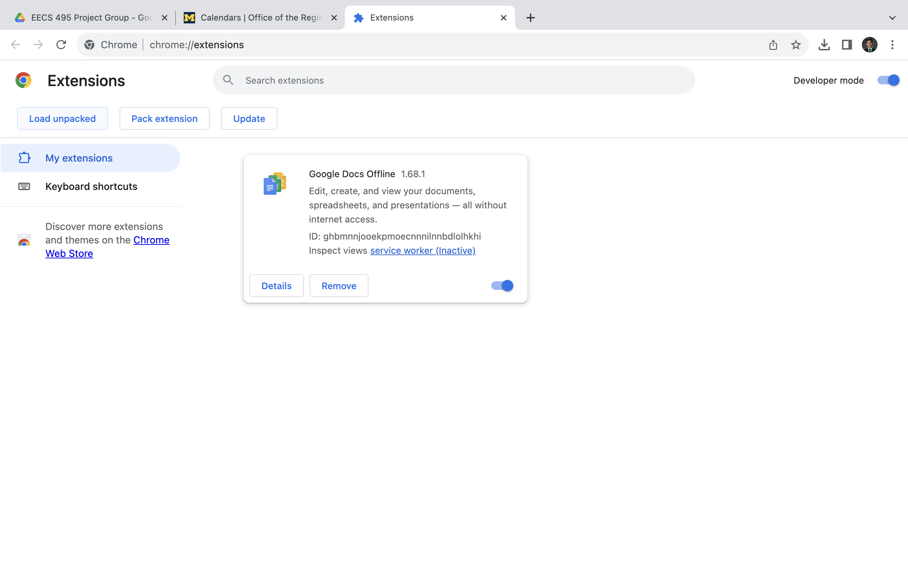
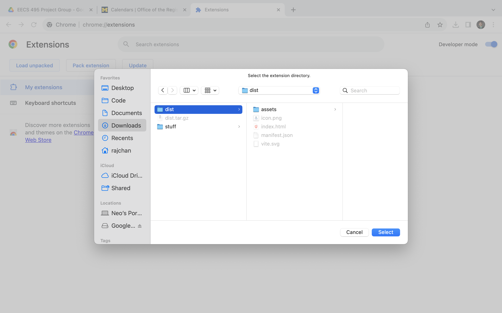
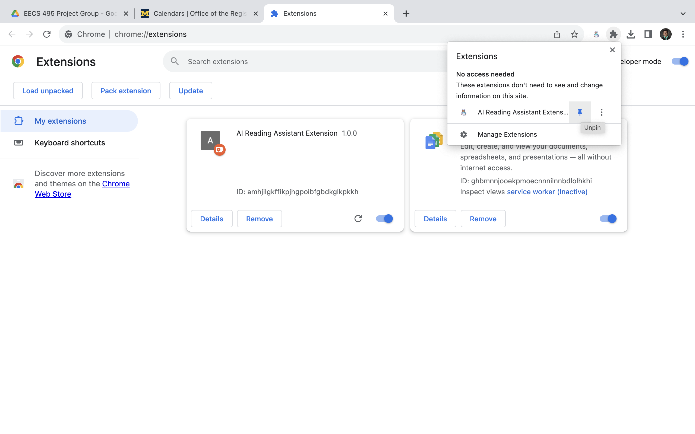
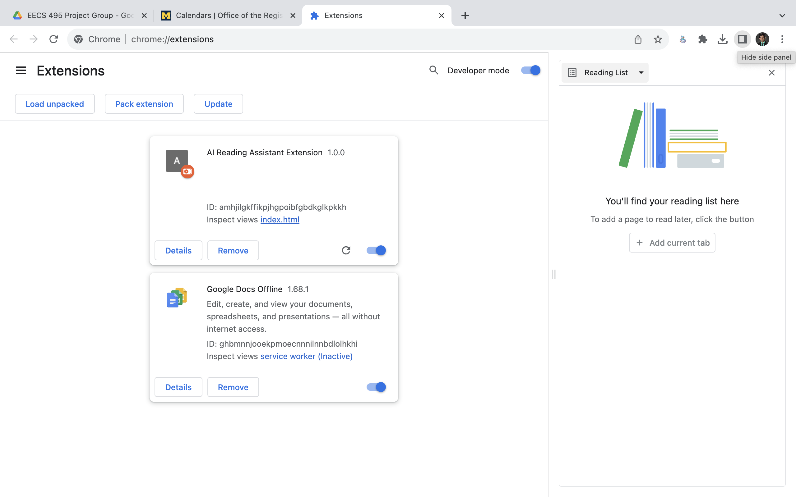
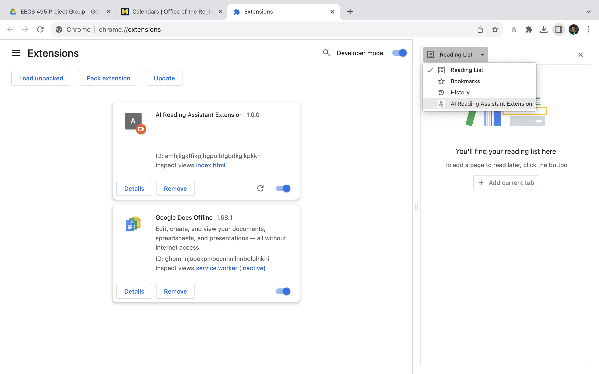
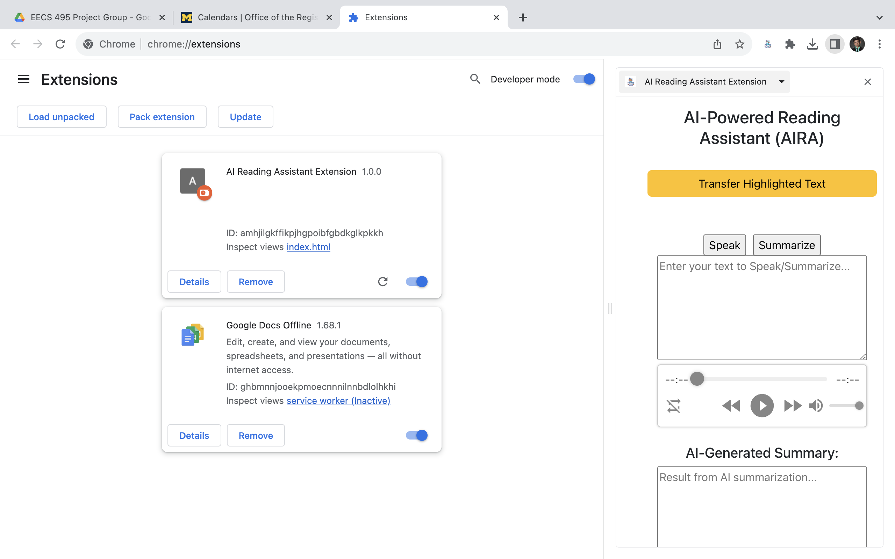

# fall23eecs495-ai-reading-assistant

## EECS 495 Staff: Read Here!

Please reach out to 495-ai-reading-assistant@umich.edu via email if there are any questions/issues regarding the instructions below and we will try our best to promptly reply!

### Chrome Extension Setup

1) Download the dist.tar.gz (shared via Google Drive) to your local machine

   
2) Untar the folder and you should have a 'dist' folder available

3) This dist folder should have the contents shown below

4) Now go back to your Chrome Web Browser and navigate to chrome://extensions

5) Toggle "Developer mode" ON in top right hand corner of page

6) Click "Load unpacked" button in top left hand corner of page

7) Navigate to the "dist" folder you downloaded earlier and select it

8) Now you should see "AI-Reading-Assistant" as one of your extensions

9) Click on puzzle piece in the top right hand corner of browser window and pin the extension

10) Click on the 'SidePanel' icon at the top right of your browser toolbar

11) Click on the 'SidePanel' dropdown and select the extension

12) Now the browser window should looks as below. Enjoy!

