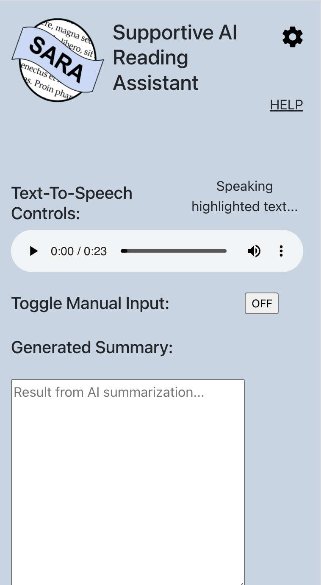

# fall23eecs495-ai-reading-assistant

## Welcome! 

This is an open source project building off work started by the team for the capstone class EECS 495: Software for Accessibility at the University of Michigan. Please contact 495-ai-reading-assistant@umich.edu via email if there are any questions/issues regarding the instructions below!

### Demo Video of Extension

https://github.com/user-attachments/assets/057cb253-8a6f-4f11-be8d-5aedca12f0a2

### User Interface of "SARA: Supportive AI Reading Assistant"
The pictures below show our extension in action:  



### Chrome Extension Setup

1) Clone the GitHub repository to your local machine
``` bash
git@github.com:dasanchez981/fall23eecs495-ai-reading-assistant.git
```

2) Ensure that NodeJS is installed on your local machine. Go [here](https://nodejs.org/en/download) for download instructions.

3) To ensure that Node Package Manager is successfully installed on your machine execute this command. This should return a version. 
```bash
npm -v
```

4) Fill in the API credentials provided in the .env.tpl file located in the ai-reading-assistant folder
``` bash
cd ai-reading-assistant
```

5) Rename the template env (.env.tpl) to .env for use in the extension
``` bash
mv .env.tpl .env
```

6) Navigate to the /ai-reading-assistant folder and install the needed node modules
``` bash
cd ai-reading-assistant
npm install
```

7) Build the extension locally by running the following command:
```bash
npm run build
```
8) Ensure that a 'dist' folder exists at ai-reading-assistant/dist, this will be loaded into the browser

9) Go to your Chrome Web Browser and navigate to chrome://extensions


10) Toggle "Developer mode" ON in top right hand corner of page

11) Click "Load unpacked" button in top left hand corner of page


12) Select the "dist" folder at /ai-reading-assistant/dist in the repository

13) Now you should see "AI-Reading-Assistant" as one of your extensions

14) Click on puzzle piece in the top right hand corner of browser window and pin the extension


15) Click on the 'SidePanel' icon at the top right of your browser toolbar


16) Click on the 'SidePanel' dropdown and select the extension


17) Now the extension should be loaded into your browser. Enjoy!
